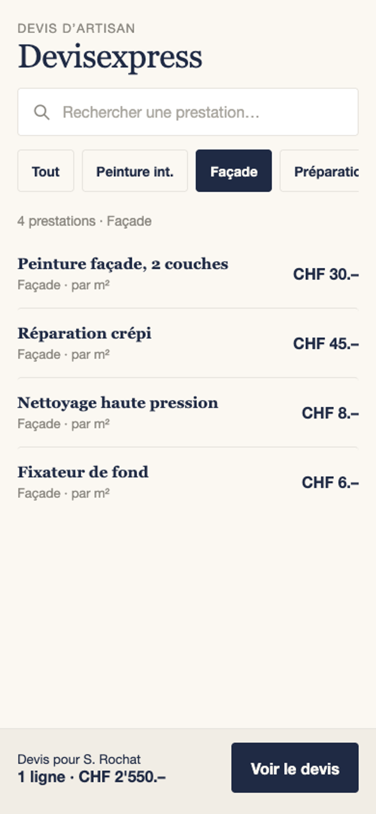
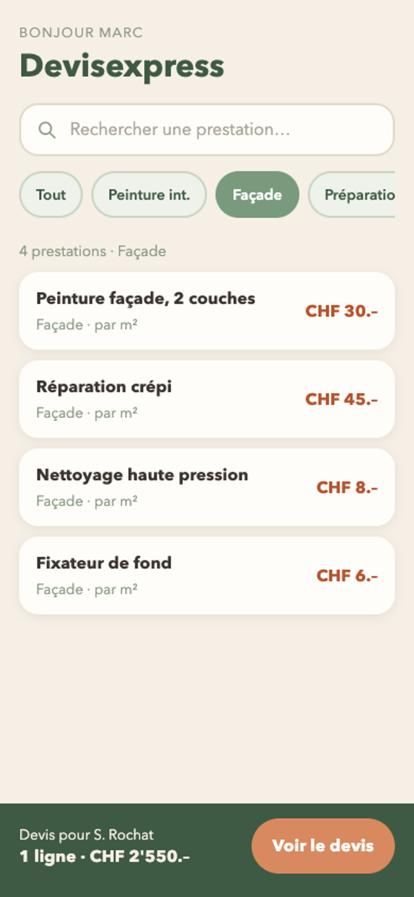
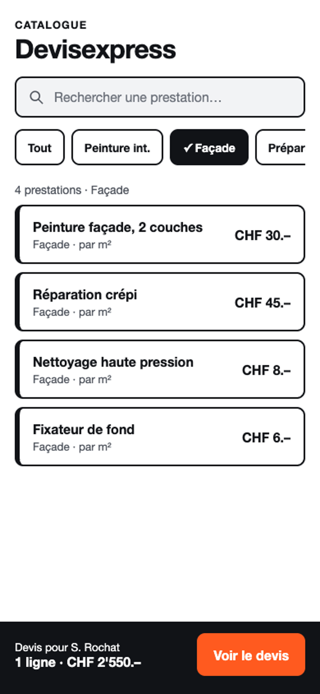
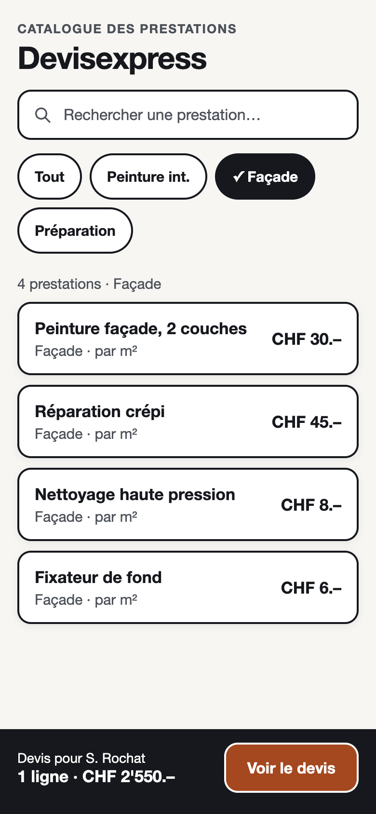

# Critique comparative & arbitrage de design — Devisexpress

Les trois propositions ont été générées par IA (HTML/CSS natif, variables CSS, zéro framework) à partir de [brief.md](../../brief.md) et du [wireframe 01](wireframes/01-accueil-mobile.png). Elles montrent le même écran : le catalogue filtré sur « Façade » avec un devis en cours.

| Piste A — Éditoriale & sobre | Piste B — Chaleureuse & terroir | Piste C — Moderne & pragmatique |
|---|---|---|
|  |  |  |

Sources HTML : [propositions/src/](propositions/src/)

## 1. Mesures objectives (contrastes WCAG 2.2)

Seuils : texte normal **≥ 4,5:1** (AA) · éléments d'interface (bordures, contours) **≥ 3:1**. Ratios calculés avec la formule de luminance relative du WCAG, sur les couleurs exactes du CSS de chaque piste.

| Élément | Piste A | Piste B | Piste C |
|---|---|---|---|
| Texte principal | 13,45:1 ✓ | 6,66:1 ✓ | 18,59:1 ✓ |
| Texte secondaire (catégorie, unité) | **3,38:1 ✗** | **2,92:1 ✗** | 8,11:1 ✓ |
| Placeholder de la recherche | **2,43:1 ✗** | — | **4,48:1 ✗** (de justesse) |
| Bouton principal « Voir le devis » | 13,45:1 ✓ | **2,73:1 ✗** | **3,12:1 ✗** |
| Puce de filtre active | 13,45:1 ✓ | **3,11:1 ✗** | 18,59:1 ✓ |
| Bordure des puces et du champ (≥ 3:1) | **1,21:1 ✗** | ✓ (fond de puce distinct) | 18,59:1 ✓ |

Autres constats vérifiables sur les captures :

- **Les trois pistes coupent la 4e puce** (« Préparatio… ») au bord droit de l'écran : la catégorie est à moitié cachée.
- **Seule la piste C** signale la puce active autrement que par la couleur (coche « ✓ »).
- Cibles tactiles : puces de 44 px dans les trois pistes (sous les 48 px du brief) ; boutons principaux de 52 px.

## 2. Matrice d'évaluation comparative (1 = cassé · 3 = moyen · 5 = ça va)

| Critère | Piste A | Piste B | Piste C |
|---|---|---|---|
| Lisibilité | 3 | 3 | **5** |
| Navigation | 3 | 4 | **4** |
| Feedback | 3 | 3 | **4** |
| Cohérence | 4 | 4 | **4** |
| Accessibilité | 2 | 2 | **3** |
| **Total / 25** | **15** | **16** | **20** |

## 3. Fiches critiques

### Piste A — Éditoriale & sobre

**2 forces**
1. Critère : cohérence — preuve : une seule couleur d'accent (bleu nuit) pour le titre, la puce active et le bouton ; l'œil sait où agir.
2. Critère : lisibilité du texte principal — preuve : 13,45:1 et titres à empattements bien hiérarchisés (34 px / 16 px).

**2 faiblesses**
1. Critère : accessibilité — preuve : texte secondaire à 3,38:1 et placeholder à 2,43:1, illisibles en plein soleil dans la camionnette de Marc.
2. Critère : navigation — preuve : les contours des puces et du champ (1,21:1) sont presque invisibles ; on ne voit pas que ce sont des boutons.

**Verdict :** j'**élimine** ce design : élégant pour un cabinet d'avocat, mais trop discret pour un artisan qui consulte son téléphone dehors, d'une main.

### Piste B — Chaleureuse & terroir

**2 forces**
1. Critère : navigation — preuve : cartes bien séparées (10 px d'écart, coins de 18 px), grandes zones à toucher avec le pouce.
2. Critère : cohérence — preuve : l'ambiance sauge / terracotta correspond au métier (matériaux, chantier) et le ton « Bonjour Marc » est humain.

**2 faiblesses**
1. Critère : accessibilité — preuve : le bouton principal blanc sur terracotta clair n'atteint que 2,73:1, et le texte secondaire 2,92:1.
2. Critère : feedback — preuve : la puce active n'est distinguée que par la couleur sauge (3,11:1), sans coche ni texte.

**Verdict :** j'**élimine** ce design tel quel, mais je **garde** son fond chaud, ses cartes arrondies et son ton humain.

### Piste C — Moderne & pragmatique

**2 forces**
1. Critère : lisibilité — preuve : texte principal 18,59:1, texte secondaire 8,11:1 ; prix et noms en gras, lisibles même au soleil.
2. Critère : feedback — preuve : la puce active est remplie **et** cochée (« ✓ Façade ») ; l'état ne dépend pas seulement de la couleur.

**2 faiblesses**
1. Critère : accessibilité — preuve : le bouton orange vif n'atteint que 3,12:1 avec le texte blanc ; le placeholder est à 4,48:1.
2. Critère : cohérence / ton — preuve : noir et blanc très durs, bordures de 6 px à gauche des cartes : l'écran fait « outil industriel » plus que « artisan de confiance ».

**Verdict :** je **garde** ce design comme base, avec les corrections ci-dessous.

## 4. Arbitrage motivé

**Nous retenons la Piste C pour sa lisibilité en plein soleil et son feedback qui ne dépend pas de la couleur — deux besoins directs de Marc, qui fait ses devis sur son téléphone dans sa camionnette — en lui intégrant le fond chaud, les cartes arrondies et le ton humain de la Piste B.**

Corrections appliquées dans la [maquette retenue](maquette-retenue/index.html) :

| Problème mesuré | Avant | Après |
|---|---|---|
| Bouton principal trop clair | orange #FF5A1F · 3,12:1 | orange chantier foncé #B23F0A · **5,82:1** |
| Placeholder limite | #6B7079 sur #F2F3F5 · 4,48:1 | #4B5059 sur blanc · **8,11:1** |
| 4e puce coupée | puces sur une ligne qui déborde | puces qui passent à la ligne, toutes visibles |
| Puces trop petites | 44 px | **48 px** de haut |
| Ambiance trop dure | fond blanc pur, bordure gauche 6 px | fond blanc cassé #F7F6F2, cartes arrondies 14 px, ombre légère |
| Focus clavier non défini | — | contour bleu 3 px (#1D4ED8 · 6,20:1), blanc sur le bandeau sombre |

