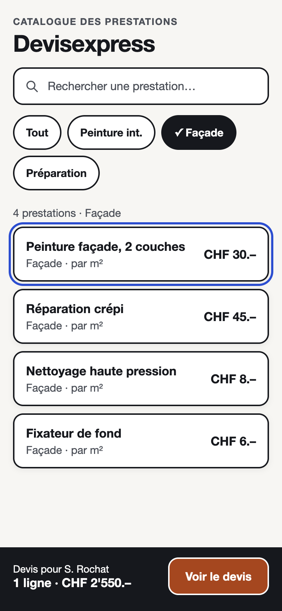

# Tests utilisateurs & audit d'accessibilité — Devisexpress

Maquette testée : [maquette-retenue/index.html](maquette-retenue/index.html) (écran 1, catalogue) et les [wireframes](wireframes/) pour la suite du parcours.

## 1. Audit d'accessibilité (fait, mesuré)

### Contrastes (norme WCAG AA : texte ≥ 4,5:1 · interface ≥ 3:1)

| Élément | Couleurs | Ratio mesuré | Résultat |
|---|---|---|---|
| **Bouton principal « Voir le devis »** | blanc / #B23F0A | **5,82:1** | ✓ AA |
| Texte principal | #16181D / #F7F6F2 | 16,42:1 | ✓ AAA |
| Texte secondaire | #4B5059 / #F7F6F2 | 7,50:1 | ✓ AAA |
| Texte du bandeau | blanc / #16181D | 17,76:1 | ✓ AAA |
| Message d'erreur | #B3261E / #F7F6F2 | 6,04:1 | ✓ AA |
| Message de succès | #1E6B3A / #F7F6F2 | 6,03:1 | ✓ AA |
| Contour de focus | #1D4ED8 / #F7F6F2 | 6,20:1 | ✓ (≥ 3:1) |
| Bouton orange sur bandeau sombre | #B23F0A / #16181D | 3,05:1 | ✓ de justesse (≥ 3:1) → bordure blanche ajoutée autour du bouton |

### Navigation complète au clavier, sans souris (Tab / Maj+Tab / Entrée)

Test réalisé le 09.10.2026 sur la maquette retenue, dans le navigateur, touche Tab uniquement.

| Ordre | Élément atteint | Focus visible | Hauteur |
|---|---|---|---|
| 1 | Champ « Rechercher une prestation » | ✓ contour bleu 3 px | 52 px (zone) |
| 2–5 | Puces « Tout », « Peinture int. », « ✓ Façade », « Préparation » | ✓ contour bleu 3 px | 48 px |
| 6–9 | Les 4 cartes de prestations (liens) | ✓ contour bleu 3 px | 76 px |
| 10 | Bouton « Voir le devis » | ✓ contour blanc 3 px (sur fond sombre) | 52 px |

- L'ordre suit la lecture de l'écran (haut → bas, gauche → droite) : ✓
- Aucun piège clavier, Maj+Tab revient en arrière : ✓
- Les puces sont de vrais `<button>` avec `aria-pressed`, les cartes de vrais liens : Entrée les active. ✓
- Le nombre de résultats (« 4 prestations · Façade ») est annoncé aux lecteurs d'écran (`aria-live`). ✓

## 2. Protocole du test utilisateur (préparé)

**Scénario en 1 phrase (dit au testeur) :** « Vous êtes peintre, vous venez de visiter la façade de Mme Rochat : montrez comment vous ajouteriez la peinture de la façade à son devis, puis comment vous verriez le total. »

**Déroulé (5 minutes, chronomètre) :**
1. **Test 5 secondes :** montrer [maquette-retenue.png](maquette-retenue/maquette-retenue.png) 5 secondes, la cacher, demander « C'est une appli pour… ? ».
2. **Test de localisation :** « Montrez où vous tapoteriez pour : n'afficher que les prestations de façade » puis « … pour voir le devis en cours ».
3. **Parcours sur les wireframes 01 → 03 → 04 :** le testeur dit à voix haute ce qu'il pense (*Think Aloud*).
4. Règle de l'observateur : silence, ne jamais aider, ne jamais justifier. C'est l'interface qui est testée.

## 3. Observations (à remplir PENDANT le test avec le camarade)

**App testée :** Devisexpress — maquette retenue  
**Testeur :** _(prénom du camarade)_  
**Observateur :** Killian  
**Date :** _(date du test)_  
**Tâche donnée :** voir le scénario ci-dessus

### Test 5 secondes

« C'est une appli pour… » (phrase exacte du testeur) :

Écart avec l'intention (« créer un devis à partir d'un catalogue de prestations ») :

### Test de localisation

Consigne 1 : « Montrez où vous tapoteriez pour n'afficher que les prestations de façade »  
Le doigt est allé au bon contrôle : oui / non / à côté  
Hésitation :  
Dit à voix haute :  
J'ai aidé : oui / non

Consigne 2 : « Montrez où vous tapoteriez pour voir le devis en cours »  
Le doigt est allé au bon contrôle : oui / non / à côté  
Hésitation :  
Dit à voix haute :  
J'ai aidé : oui / non

### Parcours complet (wireframes)

- Hésitations observées (regard perdu, clics à côté) :
- Remarques spontanées à voix haute :
- **Temps pour accomplir la tâche :** ___ min ___ s

## 4. Deux correctifs prioritaires (à déduire du test)

| # | Friction observée | Avant | Après (prévu) |
|---|---|---|---|
| 1 | | | |
| 2 | | | |
