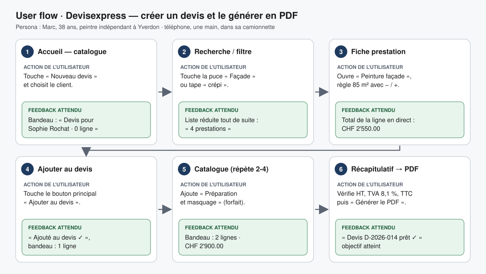

# User flow — tâche principale

**Tâche :** créer un devis pour un client et le générer en PDF.

**Persona :** Marc, 38 ans, peintre indépendant ([persona.md](persona.md)), sur son téléphone dans sa camionnette.

**Début :** la personne ouvre Devisexpress sur son téléphone après la visite d'un chantier.  
**Fin réussie :** la personne a un devis PDF avec le bon client, les bonnes prestations et le bon total TTC, prêt à être envoyé.

## Chemin

| # | Écran traversé | Action de l'utilisateur | Feedback attendu de l'interface |
|---|---|---|---|
| 1 | **Accueil — catalogue** | Ouvre l'app et touche « Nouveau devis », puis choisit le client « Sophie Rochat » dans la liste. | Le bandeau du bas affiche « Devis pour Sophie Rochat · 0 ligne · CHF 0.00 ». |
| 2 | **Recherche / filtre** | Touche la puce « Façade » (ou tape « crépi » dans la recherche). | La liste se réduit tout de suite ; le compteur indique « 4 prestations ». La puce active est remplie (pas seulement colorée). |
| 3 | **Fiche prestation** | Ouvre « Peinture façade, 2 couches » et règle la quantité à 85 m² avec les boutons − / +. | Le total de la ligne se recalcule en direct : « 85 m² × CHF 30.00 = CHF 2'550.00 ». |
| 4 | **Fiche prestation → action** | Touche « Ajouter au devis ». | Message « Ajouté au devis ✓ » pendant 2 secondes ; retour au catalogue ; le bandeau passe à « 1 ligne · CHF 2'550.00 ». |
| 5 | **Catalogue (répétition)** | Répète les étapes 2 à 4 pour « Préparation et masquage » (forfait). | Le bandeau affiche « 2 lignes · CHF 2'900.00 ». |
| 6 | **Récapitulatif du devis** | Touche « Voir le devis », vérifie le total HT, la TVA 8,1 % et le TTC, puis touche « Générer le PDF ». | Le PDF s'ouvre dans la fenêtre d'impression du navigateur ; message « Devis D-2026-014 prêt ✓ ». |

Durée visée : moins de 3 minutes pour un devis de 2 à 3 lignes.

## Variantes d'échec

- **Pas de client choisi :** si Marc touche « Générer le PDF » sans client, l'écran dit, sous le bouton : « Choisissez d'abord un client. » et le sélecteur de client est mis en évidence (pas de `alert`).
- **Quantité à 0 ou vide :** le bouton « Ajouter au devis » reste désactivé et l'écran dit « Indiquez une quantité supérieure à 0 ».
- **Aucun résultat de recherche :** l'écran dit « Aucune prestation pour "crépis" » avec un bouton « Effacer la recherche ».
- **L'app est fermée en cours de route (appel téléphonique) :** à la réouverture, le bandeau dit « Devis en cours pour Sophie Rochat — reprendre ? ».

## Schéma

